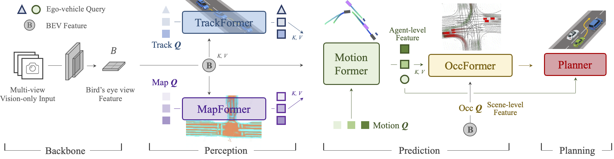
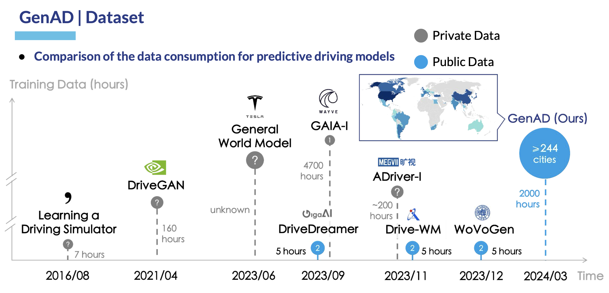

<div align="center">   
  
# Planning-oriented Autonomous Driving
</div>


<h3 align="center">
  <a href="https://arxiv.org/abs/2212.10156">arXiv</a> |
  <a href="https://www.youtube.com/watch?v=cyrxJJ_nnaQ">Video</a> |
  <a href="sources/cvpr23_uniad_poster.png">Poster</a> |
  <a href="https://opendrivelab.com/e2ead/UniAD_plenary_talk_slides.pdf">Slides</a>
</h3>


https://github.com/OpenDriveLab/UniAD/assets/48089846/bcf685e4-2471-450e-8b77-e028a46bd0f7


<br><br>



## Table of Contents:
1. [Highlights](#high)
2. [News](#news)
3. [Getting Started](#start)
   - [Installation](docs/INSTALL.md)
   - [Prepare Dataset](docs/DATA_PREP.md)
   - [Evaluation Example](docs/TRAIN_EVAL.md#example)
   - [GPU Requirements](docs/TRAIN_EVAL.md#gpu)
   - [Train/Eval](docs/TRAIN_EVAL.md)
4. [Results and Models](#models)
5. [TODO List](#todos)
6. [License](#license)
7. [Citation](#citation)
8. [🔥 See Also: GenAD & Vista](#see)

## Highlights <a name="high"></a>

- :oncoming_automobile: **Planning-oriented philosophy**: UniAD is a Unified Autonomous Driving algorithm framework following a planning-oriented philosophy. Instead of standalone modular design and multi-task learning, we cast a series of tasks, including perception, prediction and planning tasks hierarchically.
- :trophy: **SOTA performance**: All tasks within UniAD achieve SOTA performance, especially prediction and planning (motion: 0.71m minADE, occ: 63.4% IoU, planning: 0.31% avg.Col)

## News <a name="news"></a>

- **`Paper Title Change`**: To avoid confusion with the "goal-point" navigation in Robotics, we change the title from "Goal-oriented" to "Planning-oriented" suggested by Reviewers. Thank you!

- **`Planning Metric`**: Discussion [Ref: https://github.com/OpenDriveLab/UniAD/issues/29]: [Clarification](https://github.com/OpenDriveLab/UniAD/issues/29#issuecomment-1583070151) and [Notice](https://github.com/OpenDriveLab/UniAD/issues/29#issuecomment-1717594344) regarding open-loop planning results comparison.

- **`2024/08/27`** New feature: Implementation for CARLA and closed-loop evaluation on CARLA Leaderboard 2.0 scenarios are available in [Bench2Drive](https://github.com/Thinklab-SJTU/Bench2Drive).

- **`2023/08/03`** Bugfix [[Commit](https://github.com/OpenDriveLab/UniAD/commit/2e1380143d7af7c93bd67725a11d6960fa4347c6)]: Previously, the visualized planning results were in opposition on the x axis, compared to the ground truth. Now it's fixed.

- **`2023/06/12`** Bugfix [Ref: https://github.com/OpenDriveLab/UniAD/issues/21]: Previously, the performance of the stage1 model (track_map) could not be replicated when trained from scratch, due to mistakenly adding `loss_past_traj` and freezing `img_neck` and `BN`. By removing `loss_past_traj` and unfreezing `img_neck` and `BN` in training, the reported results could be reproduced (AMOTA: 0.393, [stage1_train_log](https://github.com/OpenDriveLab/UniAD/releases/download/v1.0/uniad_reproduce_stage1_gpu16_train.log)).

- **`2023/04/18`** New feature: You can replace BEVFormer with other BEV Encoding methods, e.g., LSS, as long as you provide the `bev_embed` and `bev_pos` in [track_train](https://github.com/OpenDriveLab/UniAD/blob/cb4e3dc336ac9f94897ef3c7d85edba85a507726/projects/mmdet3d_plugin/uniad/detectors/uniad_track.py#L394) and [track_inference](https://github.com/OpenDriveLab/UniAD/blob/cb4e3dc336ac9f94897ef3c7d85edba85a507726/projects/mmdet3d_plugin/uniad/detectors/uniad_track.py#L661). Make sure your bevs and ours are of the same shape.
- **`2023/04/18`** Base-model checkpoints are released.


- **`2023/03/29`** Code & model initial release `v1.0`.
- **`2023/03/21`** 🌟🌟 UniAD is accepted by CVPR 2023, as an **Award Candidate** (12 out of 2360 accepted papers)!
- **`2022/12/21`** UniAD [paper](https://arxiv.org/abs/2212.10156) is available on arXiv.


## Getting Started <a name="start"></a>
- [Installation](docs/INSTALL.md)
- [Prepare Dataset](docs/DATA_PREP.md)
- [Evaluation Example](docs/TRAIN_EVAL.md#example)
- [GPU Requirements](docs/TRAIN_EVAL.md#gpu)
- [Train/Eval](docs/TRAIN_EVAL.md)

## Results and Pre-trained Models <a name="models"></a>
UniAD is trained in two stages. Pretrained checkpoints of both stages will be released and the results of each model are listed in the following tables.

### Stage1: Perception training
> We first train the perception modules (i.e., track and map) to obtain a stable weight initlization for the next stage. BEV features are aggregated with 5 frames (queue_length = 5).

| Method | Encoder | Tracking<br>AMOTA | Mapping<br>IoU-lane | config | Download |
| :---: | :---: | :---: | :---: | :---:|:---:| 
| UniAD-B | R101 | 0.390 | 0.297 |  [base-stage1](projects/configs/stage1_track_map/base_track_map.py) | [base-stage1](https://github.com/OpenDriveLab/UniAD/releases/download/v1.0/uniad_base_track_map.pth) |


### Stage2: End-to-end training
> We optimize all task modules together, including track, map, motion, occupancy and planning. BEV features are aggregated with 3 frames (queue_length = 3).

<!-- 
Pre-trained models and results under main metrics are provided below. We refer you to the [paper](https://arxiv.org/abs/2212.10156) for more details. -->

| Method | Encoder | Tracking<br>AMOTA | Mapping<br>IoU-lane | Motion<br>minADE |Occupancy<br>IoU-n. | Planning<br>avg.Col. | config | Download |
| :---: | :---: | :---: | :---: | :---:|:---:| :---: | :---: | :---: |
| UniAD-B | R101 | 0.363 | 0.313 | 0.705 | 63.7 | 0.29 |  [base-stage2](projects/configs/stage2_e2e/base_e2e.py) | [base-stage2](https://github.com/OpenDriveLab/UniAD/releases/download/v1.0.1/uniad_base_e2e.pth) |

### Checkpoint Usage
* Download the checkpoints you need into `UniAD/ckpts/` directory.
* You can evaluate these checkpoints to reproduce the results, following the `evaluation` section in [TRAIN_EVAL.md](docs/TRAIN_EVAL.md).
* You can also initialize your own model with the provided weights. Change the `load_from` field to `path/of/ckpt` in the config and follow the `train` section in [TRAIN_EVAL.md](docs/TRAIN_EVAL.md) to start training.


### Model Structure
The overall pipeline of UniAD is controlled by [uniad_e2e.py](projects/mmdet3d_plugin/uniad/detectors/uniad_e2e.py) which coordinates all the task modules in `UniAD/projects/mmdet3d_plugin/uniad/dense_heads`. If you are interested in the implementation of a specific task module, please refer to its corresponding file, e.g., [motion_head](projects/mmdet3d_plugin/uniad/dense_heads/motion_head.py).


## License <a name="license"></a>

All assets and code are under the [Apache 2.0 license](./LICENSE) unless specified otherwise.

## Citation <a name="citation"></a>


If you find our project useful for your research, please consider citing our paper and codebase with the following BibTeX:


```bibtex
@inproceedings{hu2023_uniad,
 title={Planning-oriented Autonomous Driving}, 
 author={Yihan Hu and Jiazhi Yang and Li Chen and Keyu Li and Chonghao Sima and Xizhou Zhu and Siqi Chai and Senyao Du and Tianwei Lin and Wenhai Wang and Lewei Lu and Xiaosong Jia and Qiang Liu and Jifeng Dai and Yu Qiao and Hongyang Li},
 booktitle={Proceedings of the IEEE/CVF Conference on Computer Vision and Pattern Recognition},
 year={2023},
}
```

```bibtex
@misc{contributors2023_uniadrepo,
  title={Planning-oriented Autonomous Driving},
  author={UniAD contributors},
  howpublished={\url{https://github.com/OpenDriveLab/UniAD}},
  year={2023}
}
```
## Related Resources

[](https://awesome.re)
- [BEVFormer](https://github.com/fundamentalvision/BEVFormer) (Ours!)
- [ST-P3](https://github.com/OpenPerceptionX/ST-P3) (Ours!)
- [FIERY](https://github.com/wayveai/fiery)
- [MOTR](https://github.com/megvii-research/MOTR)


## 🔥 See Also  <a name="see"></a>
We are thrilled to launch our recent line of works: [GenAD](https://arxiv.org/abs/2403.09630) and [Vista](https://arxiv.org/abs/2405.17398), to advance  **driving world models** with the **largest driving video dataset** collected from the web - [OpenDV](https://github.com/OpenDriveLab/DriveAGI/tree/main/opendv).


[GenAD](https://github.com/OpenDriveLab/DriveAGI): **Generalized Predictive Model for Autonomous Driving** (CVPR'24, Highlight ⭐)

<div id="top" align="center">
<p align="center">

</p>
</div>


[Vista](https://github.com/OpenDriveLab/Vista): **A Generalizable Driving World Model with High Fidelity and Versatile Controllability** 🌏
<div id="top" align="center">
<p align="center">

</p>
</div>
