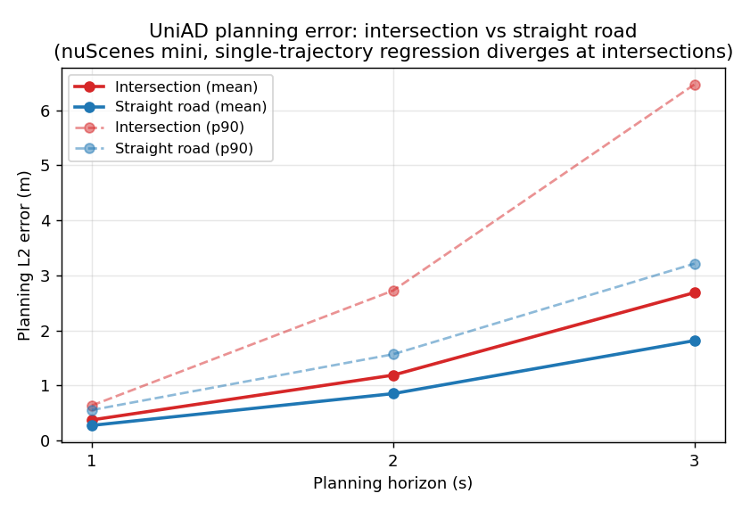

# UniAD 评测 + 误差归因工作台 — Stage 1 (mini demo)

> 把 KITTI 上验证过的"评测闭环 + 长尾难例挖掘"方法，升级到 **UniAD 端到端全栈**：
> 从逐帧 planning 指标导出，到 worst-K 难例挖掘、可视化浏览，再到**数据驱动的根因归因**。
> 本目录是在 **nuScenes-mini（81 帧）** 上跑通的方法 demo —— 重点是**管线与归因方法正确**，
> 统计数字待全量 val 复算。

---

## 0. 一句话结论

UniAD 的 planning head 是**确定性单轨迹回归**；本工作台用逐帧指标 + 场景归因，
**量化坐实**了它的核心失效模式：**长时域规划误差集中在路口** —— 路口未来是多模态
（直行/左转/右转都合理），单轨迹回归在模态间发散，表现为 **「1s 准、3s 飘」**。
这正是 VAD / VADv2 / GenAD 转向**多模态规划**的动机。

---

## 1. 问题：原生 eval 只给全局平均，看不见"哪帧、为什么失效"

UniAD 官方 eval（`PlanningMetric`）把每帧 L2/碰撞**直接累加成全局平均**，逐帧值算了却没留存。
无法做难例挖掘、无法归因。本工作台在**不改变任何全局指标数值**的前提下补齐这条数据链。

## 2. 管线（4 步）

| 步骤 | 脚本 | 产物 |
|---|---|---|
| ① 逐帧指标导出 | `tools/test.py`（改 eval）| `planning_per_frame.csv` |
| ② worst-K 难例挖掘 | `tools/mine_hard_cases.py` | `worst_K_l2_3s.csv` |
| ③ FiftyOne 难例浏览器 | `tools/fiftyone_hard_cases.py` | 6 路相机 grouped dataset |
| ④ 场景归因（路口 vs 直路）| `tools/label_scene_attribution.py` + `tools/plot_attribution.py` | `*_attr.csv` + 图表 |

每帧 CSV 列：`token, command, L2_0.5..3.0, l2_1s/2s/3s, col_0.5..3.0, col_any`
（非破坏性验证：CSV 各 `L2_*` 列均值**逐位等于**官方全局 PrettyTable 的 L2 行）。

## 3. 方法闭环：肉眼观察 → 假设 → 量化验证

1. **挖掘**：按 `l2_3s` 排 worst-K（最差帧 `l2_3s=9.18`，median 仅 1.58）。
2. **看**：worst-K 的 6 路相机导入 FiftyOne，肉眼发现 worst 帧**几乎都是大路口/交叉口**。
3. **打标**：用 nuScenes map API 给每帧打 `is_intersection`（ego 半径 3m 内是否有
   `road_segment.is_intersection`）。
4. **分桶验证**：剔除 12 个 `l2_3s==0` 的 scene-end masked 帧（3s GT 缺失，非真实误差），
   对剩余 **69 帧**按路口/直路分桶对比。

## 4. 关键结果



**路口 vs 直路，L2 mean 比值随时域单调放大**（69 有效帧，路口 33 / 直路 36，路口基率 48%）：

| 时域 | 路口 mean | 直路 mean | 比值 | 路口 p90 | 直路 p90 |
|---|---|---|---|---|---|
| l2_1s | 0.377 | 0.277 | **1.36×** | 0.64 | 0.56 |
| l2_2s | 1.190 | 0.854 | **1.39×** | 2.73 | 1.57 |
| l2_3s | 2.689 | 1.817 | **1.48×** | **6.47** | **3.22** |

**worst-K 路口率**（全部 81 帧按 `l2_3s` 降序）：

| top-K | 路口率 | 对比基率 48% |
|---|---|---|
| top-5 | **100%** | ▲ 极端长尾几乎全是路口 |
| top-10 | 70% | ▲ |
| top-15 | 53% | ≈ |
| top-20 | 45% | ≈ 回落到基率 |

**怎么读**：
- **均值**：路口误差全程更高，且比值随时域放大（1.36→1.48×）—— "1s 准、3s 飘"的多模态发散签名。
- **尾部**：l2_3s 的 **p90 路口是直路的 2.0×**；**最极端的 top-5 失效 100% 是路口**，
  到 top-20 回落到基率 —— 即**路口主导的是"灾难性长尾"，不是平均水平**。这与 FiftyOne 肉眼观察一致。

## 5. 复现

```bash
# ① 跑 eval（已改）导出逐帧 CSV -> output/planning_per_frame.csv
./tools/uniad_dist_eval.sh ./projects/configs/stage2_e2e/base_e2e.py ./ckpts/uniad_base_e2e.pth 1

# ② 场景归因打标 + ③ 图表
python tools/label_scene_attribution.py --csv output/planning_per_frame.csv
python tools/plot_attribution.py

# ④ worst-K + FiftyOne 浏览器（带 is_intersection 字段，可筛选路口/直路）
python tools/mine_hard_cases.py --csv output/planning_per_frame_attr.csv --k 15
python tools/fiftyone_hard_cases.py --worst-csv output/worst_15_l2_3s.csv --overwrite
# 在交互终端开浏览器（别走后台），保持终端开着，浏览 http://localhost:5151 ：
fiftyone app launch uniad_hard_cases --port 5151
```

## 6. 边界 / 下一步

- **样本量**：mini 仅 81 帧（路口桶 33 帧），**不追求统计显著性结论**；要写进答辩的"规划失效
  X% 来自路口"需在**全量 nuScenes val（~300G）**复算。本 demo 证明的是**方法管线正确**。
- **二级归因（待补）**：在逐帧 CSV 增加**检测 FN 数 / occ 覆盖率**列，回答"路口失效里有多少
  **还叠加了**上游感知漏检"。
- **可视化增强**：把 pred/GT 轨迹叠到 BEV / 前视图，失效原因更直观。
