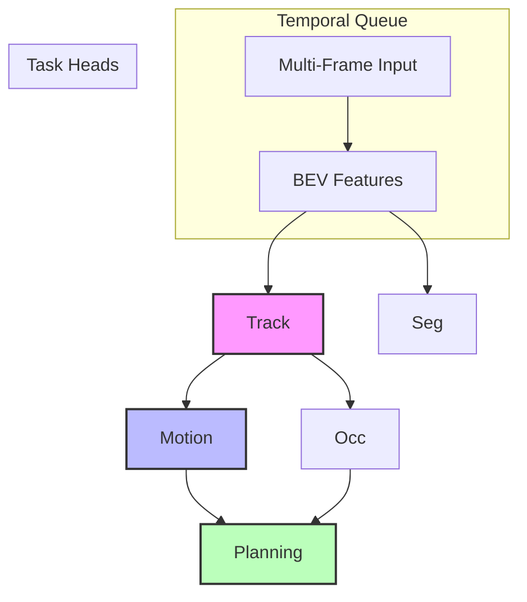

# UniAD PyTorch Operation Trace Report

**Model**: None
**Stage**: 2
**Trace Time**: 0.08 seconds

## Summary

- Total Operations: 7
- Unique Operations: 5
- Total Memory: 73.5 MB
- Total Compute Time: 4.7 ms

## Task Head Analysis

## Dataflow Visualization

